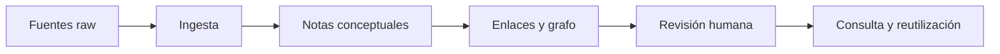

# 1

> De cara un taller de iniciación a Second Brain basado en la rama máster de este repo `therobotacademy/obsidian-llm-wiki`  dime raw repos de ejemplo

En la arquitectura de la rama `master`, los repositorios de ejemplo deberían contener el corpus original en `sources/`; la carpeta `raw/` se genera durante la ingesta y después queda inmutable. No conviene entregar `raw/` ya compilado porque se perdería una parte importante del taller: observar `Fetch → Compile → Wiki`. Véase el [repositorio base](https://github.com/therobotacademy/obsidian-llm-wiki).

Propondría estos corpus:


| Repo de taller propuesto            | Fuente pública                                                                                   | Selección inicial | Interés didáctico                              |
| ------------------------------------- | --------------------------------------------------------------------------------------------------- | -------------------: | -------------------------------------------------- |
| `second-brain-corpus-genai-es`      | [Microsoft Generative AI for Beginners](https://github.com/microsoft/generative-ai-for-beginners) |        6 lecciones | **Mi recomendación principal** para Loyola      |
| `second-brain-corpus-obsidian-es`   | [Obsidian Help](https://github.com/obsidianmd/obsidian-help)                                      |    6–7 documentos | Aprende Second Brain mientras aprende Obsidian   |
| `second-brain-corpus-adk`           | [Google ADK Docs](https://github.com/google/adk-docs)                                             |       7 documentos | Conecta con la segunda parte de IA Generativa    |
| `second-brain-corpus-mlops`         | [Made With ML](https://github.com/GokuMohandas/Made-With-ML)                                      |       8 documentos | Corpus pequeño, limpio y coherente              |
| `second-brain-corpus-system-design` | [System Design Primer](https://github.com/donnemartin/system-design-primer)                       |            7 casos | Variante avanzada con muchas relaciones cruzadas |

### 1. Corpus recomendado: IA Generativa en español

Seleccionaría:

```text
sources/
├── 01-introduccion-genai.md
├── 02-comparacion-llm.md
├── 03-ia-responsable.md
├── 04-prompt-engineering.md
├── 05-rag-vector-databases.md
└── 06-ai-agents.md
```

Procedentes de las lecciones españolas `01`, `02`, `03`, `04`, `15` y `17` de Microsoft.

Permite que aparezcan naturalmente estos topics:

```text
fundamentos-llm
prompting
gobernanza
rag
agentes
```

Es el mejor corpus para una primera edición porque los alumnos conocen parcialmente el dominio y pueden juzgar si el LLM ha creado buenos artículos y relaciones.

### 2. Corpus Obsidian/Second Brain

Tomaría de la documentación española:

```text
Enlaces internos
Enlaces de retorno
Enlaces salientes
Etiquetas
Propiedades
Plantillas
Vista de grafo
```

Aquí la pregunta final podría ser: **«¿Cómo se relacionan enlaces, propiedades, etiquetas y grafo en un sistema Second Brain?»**

### 3. Corpus Google ADK

Selección:

```text
llm-agents.md
sequential-agents.md
parallel-agents.md
loop-agents.md
state.md
memory.md
evaluate/index.md
```

Es ideal para una segunda práctica: comprobar si el wiki distingue correctamente entre arquitectura de agentes, estado, memoria y evaluación.

### Recomendación concreta

Prepararía dos niveles:

* **Taller común:** `second-brain-corpus-genai-es`, con seis fuentes.
* **Elección por grupos:** Obsidian, ADK, MLOps o System Design.

Evitaría utilizar directamente repositorios enormes o un único `README.md` monolítico —por ejemplo, todo `llm-course`— porque impide observar bien la ingesta incremental, las fusiones, las actualizaciones en cascada y la evolución del grafo.

---

# 2

> Propón alcance para **Taller común:** `second-brain-corpus-genai-es`

## Alcance recomendado del taller común

**Duración:** 3 horas presenciales
**Nivel:** iniciación; no requiere experiencia previa con Obsidian, RAG ni grafos de conocimiento.
**Corpus:** seis documentos de `second-brain-corpus-genai-es`.

### Resultado esperado

Cada participante terminará con un pequeño Second Brain funcional sobre IA generativa que:

* conserva las fuentes originales en `raw/`;
* transforma documentos en notas conceptuales;
* conecta conceptos mediante enlaces internos;
* permite navegar el conocimiento desde Obsidian;
* mantiene trazabilidad entre afirmaciones y fuentes;
* evoluciona al incorporar nuevos documentos.

La finalidad no es “resumir seis archivos”, sino comprender el ciclo:



## Corpus y estrategia de ingesta

Conviene dividir los seis documentos en dos lotes. Ingerirlos todos a la vez ocultaría la evolución del Second Brain.


| Lote            | Documentos                                                 | Finalidad didáctica                                                           |
| ----------------- | ------------------------------------------------------------ | -------------------------------------------------------------------------------- |
| A: fundamentos  | Introducción a GenAI, comparación de LLM, IA responsable | Crear el primer núcleo de conocimiento                                        |
| B: aplicaciones | Prompt engineering, RAG, agentes                           | Observar cómo aparecen conceptos nuevos y se actualizan relaciones existentes |

## Objetivos de aprendizaje

Al finalizar, el participante podrá:

1. Distinguir entre **fuente**, **extracción raw**, **nota conceptual** y **wiki compilada**.
2. Ejecutar el flujo básico de la rama `master`.
3. Reconocer por qué un Second Brain no es una colección de resúmenes.
4. Evaluar si una nota es atómica, comprensible y trazable.
5. Corregir manualmente conceptos, enlaces o metadatos.
6. Incorporar nuevas fuentes sin reconstruir todo el conocimiento.
7. Formular una consulta y comprobar la procedencia de la respuesta.

## Secuencia del taller


|        Tiempo | Actividad                                                  | Producto                |
| --------------: | ------------------------------------------------------------ | ------------------------- |
|     0–20 min | Qué es —y qué no es— un Second Brain                   | Modelo mental común    |
|   20–35 min | Exploración del corpus y de la estructura del repositorio | Mapa de fuentes         |
|    35–60 min | Preparación del entorno y Obsidian                        | Proyecto ejecutable     |
|   60–90 min | Ingesta del lote A                                         | Primer núcleo de notas |
|   90–105 min | Inspección: notas, enlaces, metadatos y trazabilidad      | Diagnóstico inicial    |
|  105–115 min | Pausa                                                      | —                      |
| 115–145 min | Ingesta incremental del lote B                             | Wiki ampliada           |
|  145–165 min | Revisión humana de una nota y sus relaciones              | Corrección documentada |
| 165–180 min | Navegación y consulta del Second Brain                    | Respuesta con fuentes   |

## Actividad central

Cada grupo seleccionará un concepto transversal, por ejemplo:

* alucinación;
* contexto;
* grounding;
* evaluación;
* memoria;
* agente;
* recuperación de información.

Después seguirá su recorrido:

1. Localizar el concepto en las fuentes.
2. Examinar cómo fue transformado en nota.
3. Revisar sus enlaces con otros conceptos.
4. Detectar una carencia, ambigüedad o enlace discutible.
5. Introducir una mejora manual.
6. Comprobar cómo cambia la navegación o interpretación del grafo.

Así se mantiene al participante como autor y curador del conocimiento, no solo como operador del pipeline.

## Entregable mínimo

Cada participante o pareja entregará:

```text
second-brain-genai/
├── raw/                     # seis fuentes conservadas
├── wiki/                    # notas generadas
├── README-taller.md         # breve descripción del resultado
└── revision-humana.md       # cambio realizado y justificación
```

`revision-humana.md` debería registrar:

* concepto revisado;
* resultado inicial;
* problema detectado;
* modificación realizada;
* fuente utilizada;
* efecto sobre la wiki.

## Criterios de éxito

El taller se considera completado cuando el participante puede demostrar:

* las seis fuentes originales y su procedencia;
* una wiki navegable en Obsidian;
* enlaces internos entre varios temas;
* diferenciación clara entre fuente y conocimiento compilado;
* al menos una revisión humana justificada;
* una respuesta de síntesis respaldada por fuentes;
* comprensión de qué ocurriría al añadir un séptimo documento.

## Fuera de alcance

Para conservar el carácter introductorio, excluiría:

* desarrollo o modificación del compilador;
* evaluación comparativa de modelos LLM;
* GraphRAG o bases de datos vectoriales externas;
* despliegue web con Quartz;
* automatización continua mediante GitHub Actions;
* ingesta masiva;
* construcción de ontologías formales;
* colaboración multiusuario;
* WikiSkill, DSPy o aprendizaje automático de nuevas reglas.

Estos elementos encajan mejor en un segundo taller: **“Del Second Brain personal al sistema de conocimiento evolutivo”**.

---

# 3
