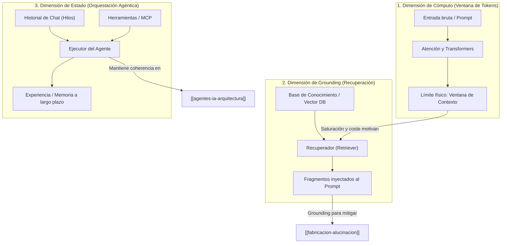

# Contexto en Sistemas de IA Generativa

El **contexto** es el conjunto de información accesible por un modelo o agente en un momento determinado para condicionar la probabilidad de la siguiente predicción o guiar la toma de decisiones autónoma.

A diferencia del uso informal en lenguaje natural, en la arquitectura de un Second Brain y en el desarrollo de sistemas con LLMs, el contexto no es un concepto monolítico, sino que se articula en **tres dimensiones funcionales interconectadas**.

---

## 1. Las Tres Dimensiones del Contexto

### A. Contexto de Cómputo: La Ventana de Tokens
* **Definición:** El límite máximo de tokens (entrada + salida) que la arquitectura del modelo puede procesar simultáneamente en su mecanismo de atención.
* **Modelos codificador vs. decodificador:**
  - Los modelos **solo decodificador** (ej. familias GPT, Llama) procesan el contexto acumulado de izquierda a derecha para generar texto de forma autorregresiva.
  - Los modelos **solo codificador** (ej. BERT) procesan el contexto bidireccional globalmente, óptimos para clasificación y análisis semántico.
* **Compromisos de ingeniería:** Ampliar la ventana de contexto tiene un coste cuadrático o lineal en cómputo, incrementa la latencia y puede diluir la precisión en la recuperación de información situada en el centro de documentos extensos (*lost in the middle*).
* *Fuente raw:* [[explorar-y-comparar-llm#Lineas-48-105|explorar-y-comparar-llm.md]]

### B. Contexto de Grounding: Aumento con Datos Externos (RAG)
* **Definición:** Información factual recuperada dinámicamente desde bases de datos vectoriales e inyectada en el prompt antes de la inferencia.
* **Causalidad:** RAG surge directamente para superar las dos limitaciones del contexto de cómputo:
  1. La incapacidad de memorizar conocimiento privado o actualizado dentro de los pesos del modelo preentrenado.
  2. El coste excesivo y la ineficiencia de pasar corpus completos dentro de la ventana de contexto en cada llamada.
* **Impacto en fiabilidad:** La adición de fragmentos (*chunks*) con contexto local relevante reduce drásticamente la [[fabricacion-alucinacion]] al fundamentar la respuesta en datos verificables.
* *Fuente raw:* [[rag-y-bases-de-datos-vectoriales#Lineas-52-139|rag-y-bases-de-datos-vectoriales.md]]

### C. Contexto de Estado: Orquestación Agéntica y MCP
* **Definición:** La persistencia temporal y estructurada de la interacción de un agente a lo largo de múltiples pasos de razonamiento, llamadas a herramientas e interacción con el usuario.
* **Niveles de contexto en agentes:**
  1. **Contexto a corto plazo (Hilos/Threads):** Historial ordenado de peticiones, respuestas y resultados de herramientas gestionado por el ejecutor del agente (*Agent Executor*).
  2. **Contexto de herramientas (MCP):** El *Model Context Protocol* proporciona al modelo los esquemas y especificaciones de las funciones que puede invocar.
  3. **Contexto a largo plazo (Experiencia/Memoria):** Persistencia de patrones de conversación y aprendizaje en formatos estructurados (como archivos YAML) para reutilización en ejecuciones futuras.
  4. **Paso de contexto inter-agente:** En arquitecturas secuenciales o jerárquicas, cada agente pasa su contexto procesado al siguiente agente de la cadena.
* *Fuente raw:* [[agentes-de-ia#Lineas-42-186|agentes-de-ia.md]]

---

## 2. Buenas Prácticas en la Gestión del Contexto (Prompt Engineering)

Para que el modelo aproveche el contexto de forma óptima:
1. **Separación de roles:** Diferenciar nítidamente entre el *contexto de sistema* (comportamiento, restricciones, personalidad) y el *contexto de tarea* (instrucción del usuario).
2. **Uso de delimitadores:** Emplear marcas claras (como comillas triples, etiquetas XML o bloques Markdown) para separar el contenido secundario o de referencia de las directrices directas.
3. **Plantillas parametrizadas:** Diseñar plantillas reutilizables donde los marcadores de posición (*placeholders*) se rellenan dinámicamente con contexto de dominio específico.
* *Fuente raw:* [[fundamentos-de-prompt-engineering#Lineas-210-345|fundamentos-de-prompt-engineering.md]]

---

## 3. Enlaces Relacionados en la Wiki

* [[ventana-de-contexto]] — Análisis técnico de límites de tokens y latencia.
* [[rag-bases-vectoriales]] — Pipeline de indexación, incrustación y recuperación semántica.
* [[agentes-ia-arquitectura]] — Patrones de orquestación, bucles de razonamiento y estado.
* [[fabricacion-alucinacion]] — Métodos de mitigación mediante anclaje contextual.
* [[ia-responsable-principios]] — Consideraciones éticas del contexto de uso de la IA.
